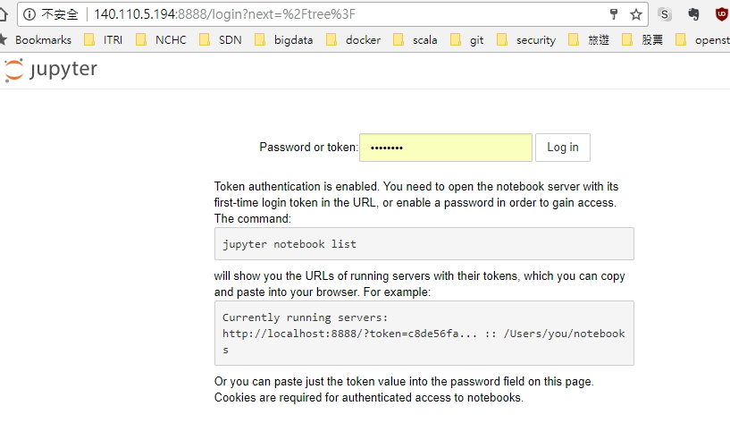
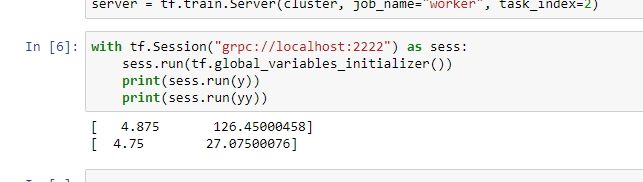
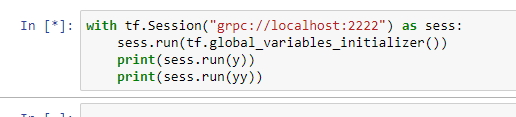

## Use Jupyter run TensorFlow
```bash
$ kubectl create -f master.yml
$ kubectl create -f worker0.yml
$ kubectl create -f worker1.yml
```


```bash
$ vim master.yml
...
  externalIPs:
  - 140.110.5.194
...
```

Use p@ssw0rd to login to `externalIPs`





## Note:
If workers are not available, the jupyter will hang forever. Check the output of master, we can see master is waiting for workers.  

```bash
$ kubectl logs master-1194246883-5v7pv
...
tions.
I tensorflow/core/distributed_runtime/rpc/grpc_channel.cc:200] Initialize GrpcChannelCache for job worker -> {0 -> worker0.default.svc.cluster.local:2222, 1 -> worker1.default.svc.cluster.local:2222, 2 -> localhost:2222}
I tensorflow/core/distributed_runtime/rpc/grpc_server_lib.cc:221] Started server with target: grpc://localhost:2222
I tensorflow/core/distributed_runtime/master.cc:193] CreateSession still waiting for response from worker: /job:worker/replica:0/task:0
I tensorflow/core/distributed_runtime/master.cc:193] CreateSession still waiting for response from worker: /job:worker/replica:0/task:1
I tensorflow/core/distributed_runtime/master.cc:193] CreateSession still waiting for response from worker: /job:worker/replica:0/task:0
I tensorflow/core/distributed_runtime/master.cc:193] CreateSession still waiting for response from worker: /job:worker/replica:0/task:1
```