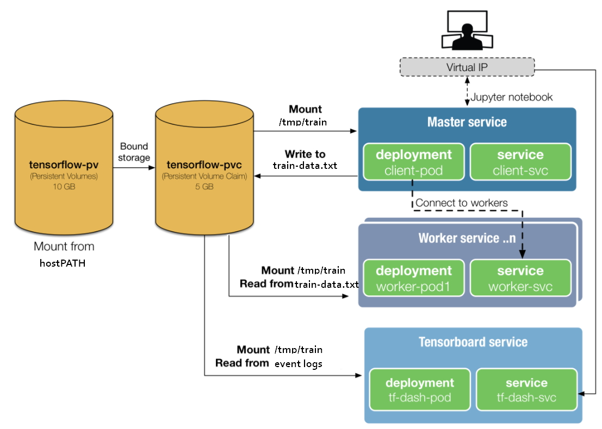
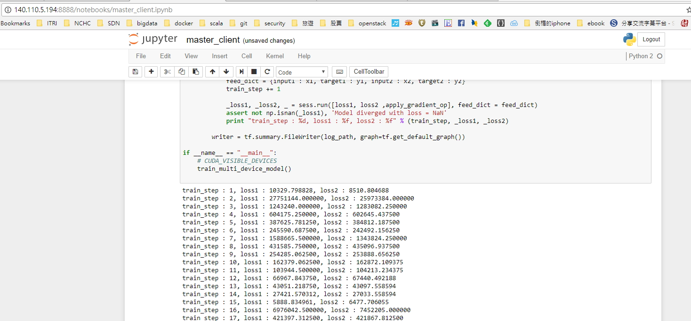
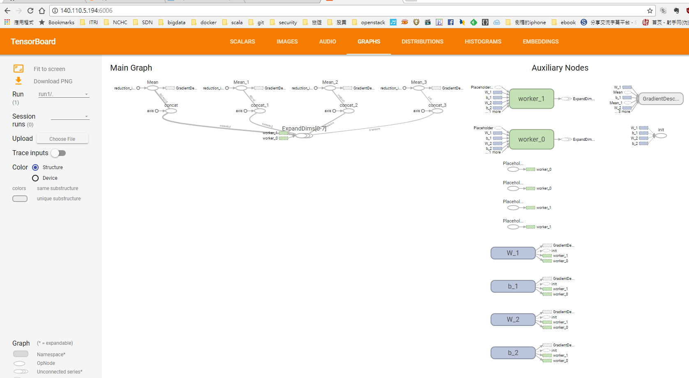

## Run TensorFlow in distributed K8S
If we wnat to data can be shared by multiple Pods, we can use [Persistent Volumes](https://kubernetes.io/docs/concepts/storage/persistent-volumes/) to store data in a shared storage backend. In this lab, mater service downloads and save  train-data in a shared storage, and multiple workers can access the data and analyze it, Event logs is also generated, tensorboard can visualize the graph,



Create a  persistent volumes and is shared with all Pods.
```bash
$ kubectl create -f pv_host.yml
$ kubectl get pv
NAME       CAPACITY   ACCESSMODES   RECLAIMPOLICY   STATUS    CLAIM               STORAGECLASS   REASON    AGE
lab06-pv   10Gi       RWO           Recycle         Bound     default/lab06-pvc                            25m
```
### Note:
For demonstration, this lab use local host as persistent volume backend, a NFS backend persistent volumes example can be seen in  [pv_nfs_sample.yml](https://github.com/ogre0403/Distributed-GPU-TensorFlow-on-K8S/blob/master/lab06/pv_nfs_sample.yml)

```bash
$ kubectl create -f master.yml
$ ls /tmp/k8s/lab06
...
-rw-r--r-- 1 root root 16489154 Sep  4 23:16 train-data.txt
```

```bash
$ kubectl create -f worker0.yml
$ kubectl create -f worker1.yml
```
Login and run the jupyter code is similar to [lab05](https://github.com/ogre0403/Distributed-GPU-TensorFlow-on-K8S/tree/master/lab05#use-jupyter-run-tensorflow)




After compute finished, an event logs is also written into the shared persistent volumes. Tensorboard can visualize the tensorflow graph.
```bash
$ ls /tmp/k8s/lab06
total 16340
-rw-r--r-- 1 root root    78622 Sep  4 03:48 events.out.tfevents.1504511052.master-3675419872-2qk60

$ kubectl create -f  tensorboard.yml
```



Finally, delete all Pods. 
```bash
$ kubectl delete -f master.yml
$ kubectl delete -f worker0.yml
$ kubectl delete -f worker1.yml
$ kubectl delete -f tensorboard.yml
```
